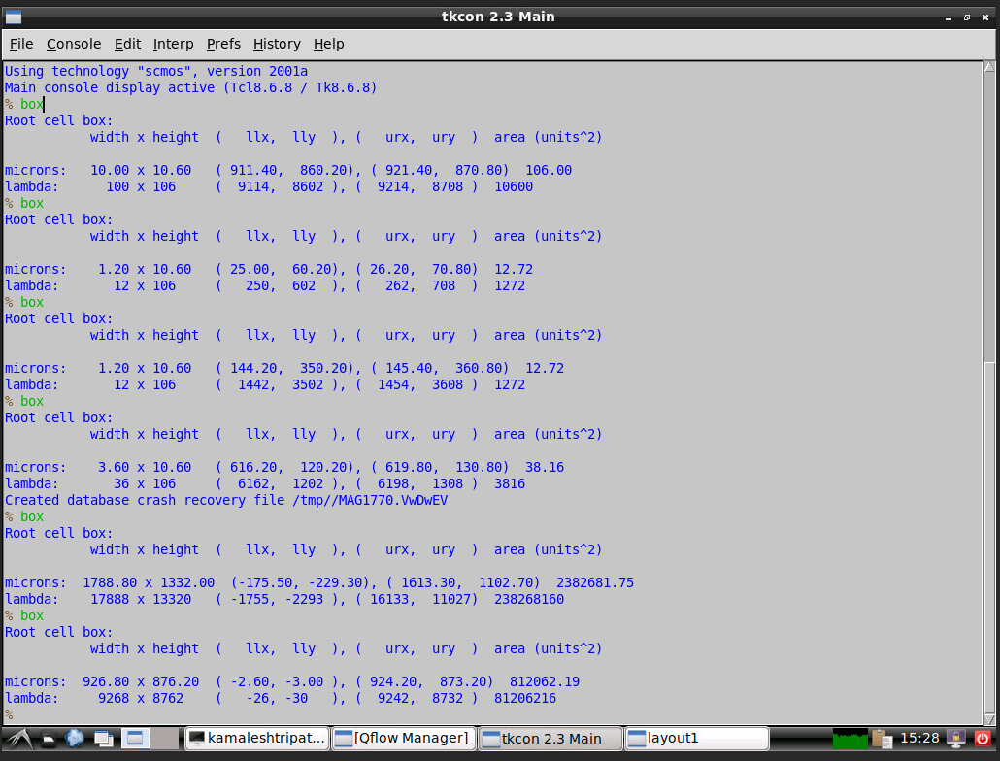

# DAY-1: Study and review various components of RISC-V based picoSoC
1. IC design component terminology
2. Introduction to RISC-V
3. RIC-V based SoC reference design
4. Introduction to open source EDA tools

Lab Activities on Day-1:
D1SK4-MCQ5 

D1SK4 - MCQ6

D1SK4 - MCQ7

D1SK4 - MCQ8

# DAY-2: Chip planning strategies and introduction to foundry library cells
1.Chip floor planning consideration
2. Library Binding and placement
3. Cell design and characterization flow
4. General timing characterization parameters

Lab Activities on Day-2:
D2SK4 - MCQ5

# Day-3: Design and characterize one library cell using Magic Layout tool and ngspice
1. Labs for CMOS Inverter NGSPICE simulation
2. Euler's Path and Stick diagram for layout
3. Magic and post layout simulation
4. Inception of layout- CMOS fabrication model

Lab Activities on Day-3:

D3SK1 - MCQ5-7  

D3SK1 - MCQ8-9

D3SK1 - MCQ10

 
D3SK1 - MCQ11

D3SK2 - MCQ1-3

D3SK3 - MCQ3-4

D3SK3 - MCQ5

# Day-4 Pre-layout timing analysis and importance of good clock tree
1. Timing modelling using Delay table
2. Timing analysis using ideal clock
3. Clock tree synthesis and signal Integrity
4. Timing analysis with real clocks

Lab Activities on Day-4:

D4SK1 - MCQ6

