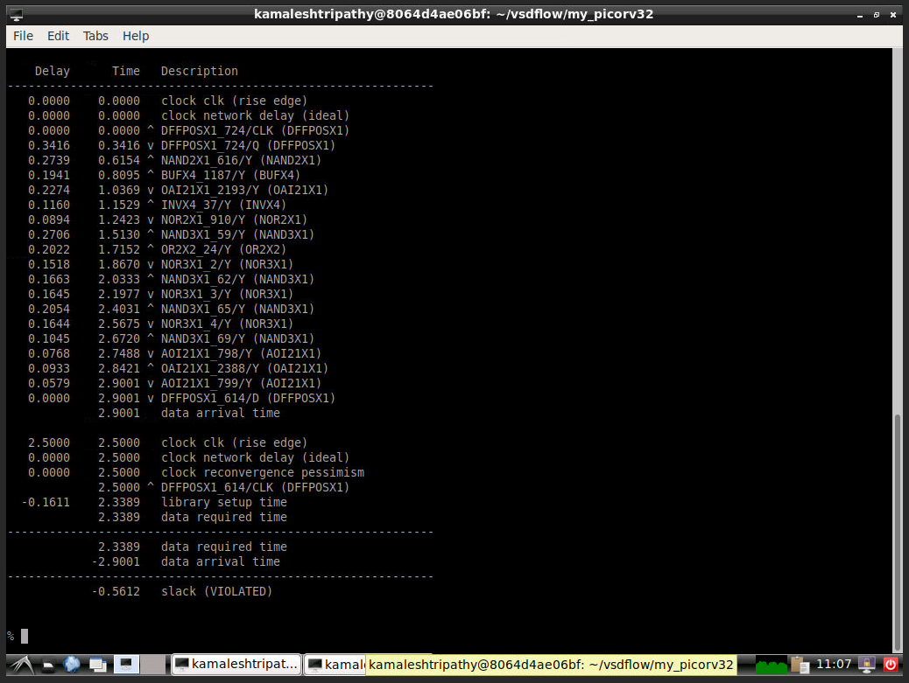
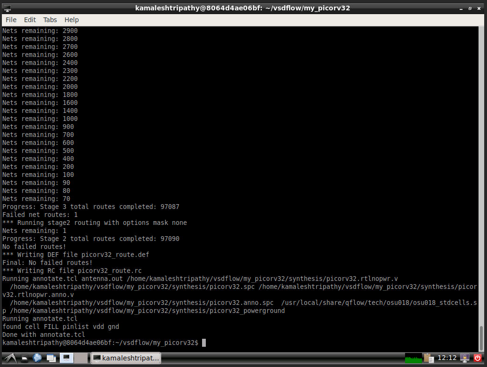

# DAY-1: Study and review various components of RISC-V based picoSoC
1. IC design component terminology
2. Introduction to RISC-V
3. RIC-V based SoC reference design
4. Introduction to open source EDA tools

     Here we lstudied design of QFN-48, which stands for Quad Flat No leads with 48 ports and dimension- 7nm*7nm
Using RISC-V architecture and then HDL (Hardware Description Language) specifications incorporated in assembly language is implemented in layout to realise the hardware.

     Different open source EDA tools are available for IC design and simulation.
Virtual Box is needed to install Linux OS on Windows so that you can install all these necessary Open Source EDA tools
1. Logic Synthesis - Yosys Open Synthesis Suite 
2. Floorplanning and Placement - Graywolf
3. CTS (Clock Tree Synthesis) -  Graywolf
4. Routing - QRouter
5. STA( Static Timing Analysis )- Opentimer
6. Layout - Magic-Layout Viewr
7. Pre-layout and Post-layout spice simulations - Ngspice
8. Schematic Editor - eSim

Lab Activities on Day-1:

First required files are downloaded and then in Qflow manager gui, circuit preparation and synthesis for backend synthesis flow is done.

D1SK4-MCQ5 

D1SK4 - MCQ6

D1SK4 - MCQ7

D1SK4 - MCQ8

# DAY-2: Chip planning strategies and introduction to foundry library cells
1. Chip floor planning consideration
2. Library Binding and placement
3. Cell design and characterization flow
4. General timing characterization parameters

     Physial design includes  dimensions of core and die, floorplanning (arrangement of the IPs) and also the electrical aspets like effetof decopling capacitors, power planning (to use multiple Vss and Vdd in a mesh to provide required power/voltage). Apart from these Pin placement and logical cell placement blockage, Netlist binding and initial place design, final placement optimization, Need for libraries and characterization, Circuit design step, layout design step, typical characterization flow, timing threshold definitions, propogation delay and transition time etc. are also briefly studied.

Lab Activities on Day-2:

Whole chip area is measured in Layout and tckon window

D2SK4 - MCQ5

# Day-3: Design and characterize one library cell using Magic Layout tool and ngspice
1. Labs for CMOS Inverter NGSPICE simulation
2. Euler's Path and Stick diagram for layout
3. Magic and post layout simulation
4. Inception of layout- CMOS fabrication model

Modelling of PMOS and NMOS for a CMOS inverter using NGSPICE is disussed where output for different values of width to length ratio of channel and load capacitance
were studied. Layout with only stick diagram leads to inefficient routing and may cause violation of DRC rules. So euler's path is used along with stick diagram for effiient layout. Concepts regarding cript to create layout in Magic ,final layout and input/output labelling and post layout ngspice simulation are also discussed briefly.
In this day of workshop different aspects of CMOS fabrication models i.e.  formation of N well and P well, formation of gate terminal, lightly doped drain (LDD) formation, source drain formation, local interconnect formation, higher level metal formation etc are also been incorporated for better understanding.
 
 Lab Activities on Day-3:

Using NGspice simulator, CMOS inverter is created and input and output characteristics are studied. Also by varying channel width of PMOS, better switching threshold is obtained.

D3SK1 - MCQ5-7  

D3SK1 - MCQ8-9

D3SK1 - MCQ10

 
D3SK1 - MCQ11

Prelayout simulation is carried out and then using Euler's path and stick diagram Layout has been done. 

D3SK2 - MCQ1-3

D3SK3 - MCQ3-4

Post-layout simulation is done with the exact stimulus that was given to pre-layout spice network.

D3SK3 - MCQ5

# Day-4 Pre-layout timing analysis and importance of good clock tree
1. Timing modelling using Delay table
2. Timing analysis using ideal clock
3. Clock tree synthesis and signal Integrity
4. Timing analysis with real clocks

Usage of delay Tables, setup Timing Analysis, hold Timing Analysis, clock Jitter & uncertainities, clock tree routing and buffering using H tree algorithm, crosstalk and clock net shielding improve the design towards the practical senario.

Lab Activities on Day-4:

In NGspice model input rise slew and output rise delay with capacitive load 10fF and 20fF are measured.

D4SK1 - MCQ6

D4SK1 - MCQ7

D4SK1 - MCQ8

Different timing parameters for 180 nm technology is observed from the given library

D4SK2 - MCQ7-10

Timing analysis with ideal clock is carried out

D4SK2 - MCQ11

D4SK2 - MCQ12-13

Timing analysis with real clock

D4SK4 - MCQ2-4

D4SK4 - MCQ5

# Day-5: Final steps for RTL2GDS
1. Routing and DRC (Design Rule Check)
2. PNR Interactive Flow Tutorial

Maze routing (Lee's algorithm) uses grid to connect source and target in a efficient way.
Various DRC specifications, IEEE 1481-1999 SPEF fomat, placement and pre layout STA, routing and post-route STA were also analysed in this day of workshop.

Lab Activities on Day-5:

Routing is done in Qflow manager and then we compare pre-layout and post-layout frequencies and it is found that there is a drop of frequency for post-layout due to parasitics. 

D5SK1 - MCQ1-3

# Acknowledgement
Kunal Ghosh , Co-founder (VSD Corp. Pvt. Ltd).

